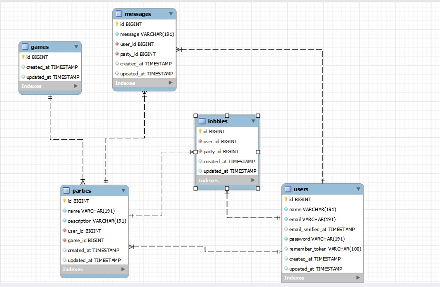

#  Project 7 Geekshubs Academy: Back-end written with PHP and Laravel  

<div align="center">
    
    
    
    
</div>

***

## Click [here ](https://github.com/callumgordon90/Proyecto-7-GeeksHubsAcademy) to see the repository for this project in my Github

***
# Summary of the project:

For this project we were tasked with creating a fully functioning backend (Rest API with full CRUD functionality, connecting to a database).

The technologies used for this project were PHP, laraval and MySQL. 

***

The rubric given to us by Geekshubs academy was as follows:


_"A company you work for wants to give a boost to the way employees relate to each other, allowing them to contact each other by creating interest groups._

_A first phase of this project is to create an LFG web application, which will allow employees to contact other employees in the company._

_Employees can contact other colleagues to form groups to play videogames, with the aim of sharing after-work leisure time"._

* * * 

The functional requirements of the application were as follows:

* Users must be able to register to the application, by establishing a username/password.

*  Users must be able to authenticate themselves to the application by logging in.
  
*  Users have to be able to create parties (groups) for a given video game.
*  Users must be able to search for parties by selecting a video game.


* * * 

In addition to the above we had to include the following functionality:

*  User registration.
  
*  User login + token + middleware.
CRUD of the different models.


***

My design for the tables in the relational database: 



***

# The tables of my database explained:

1. The table `Users` is where all the data of the users is stored.
2. Users can join in groups or parties called `Parties`.
3. To link users to games, the creation of the `Lobbies` table was necessary. This is a 'many to many' table which connects the users to the parties
4. `Games` contains all of the information about each game.
5. Within the games, the users can send messages to each other to be seen by all the members of the game; hence the `Messages` table to manage this functionality.


---------------------------------------------------

## Pre-requisites of the project to run on your local computer:


### First clone the repository:

    ```bash
    git clone https://github.com/callumgordon90/Proyecto-7-GeeksHubsAcademy.git
    ```

    In VSC, type `cd projectsevenlaravel`.

### Then install all dependencies in the command line:

    ```bash
    composer install
    ```

## Make the migrations to your Database:
   NOTE: You need to have mysql installed and running on your computer for this to work. You need to create the db directly on mysql.

    ```bash
    php artisan migrate
    ```

## Run the server:

    ```bash
    php artisan serve
    ```

## Configuring .env:
In your repository copy the `.env.example` file and rename it to `.env`, there you need to edit these variables with your data:
```
APP_KEY=

DB_DATABASE=laravel
DB_USERNAME=root
DB_PASSWORD=
```

Now you will be able to run the API.

***

# ENDPOINTS OF MY PROJECT: 
### Endpoints of my project can be found in:
```
Users:

http://localhost:8000/api/auth

POST    register a user /register
POST    login a user    /login
POST    logout a user   /logout			(authorisation token required)
GET get all users   /

http://localhost:8000/api/users

GET return user with specific id    /:id<integer>	
PUT change user with specific id    /:id<integer>	
DELETE  delete user with specific id    /:id<integer>	

Games:

http://localhost:8000/api/games

POST    create new game /	
GET return all games    /	
GET return game with specific id    /:id<integer>	
GET return parties from game with specific id   /:id<integer>/parties	(with authorisation)
PUT change game with specific id    /:id<integer>	
DELETE  delete game with specified id   /:id<integer>	


Parties:

http://localhost:8000/api/parties

POST    create new party    /	
GET return all parties  /	
GET return party with specified id  /:id<integer>	
GET return messages from party with specified id    /:id<integer>/messages	(with authorisation)
PUT change party with specified id  /:id<integer>	
DELETE  delete party with specified id  /:id<integer>	


Messages:

http://localhost:8000/api/messages

POST    create new message  /	
GET return all messages /	
GET return message with specified id    /:id<integer>	
PUT change message with specified id    /:id<integer>	
DELETE  delete message with specified id    /:id<integer>

Lobbies:

http://localhost:8000/api/member

POST create new member  /	
GET return all members  /	
GET return member with specified id /:id<integer>
DELETE  delete member with specified id /:id<integer>

```

-----------------------------------

by Callum Gordon

---------------------


